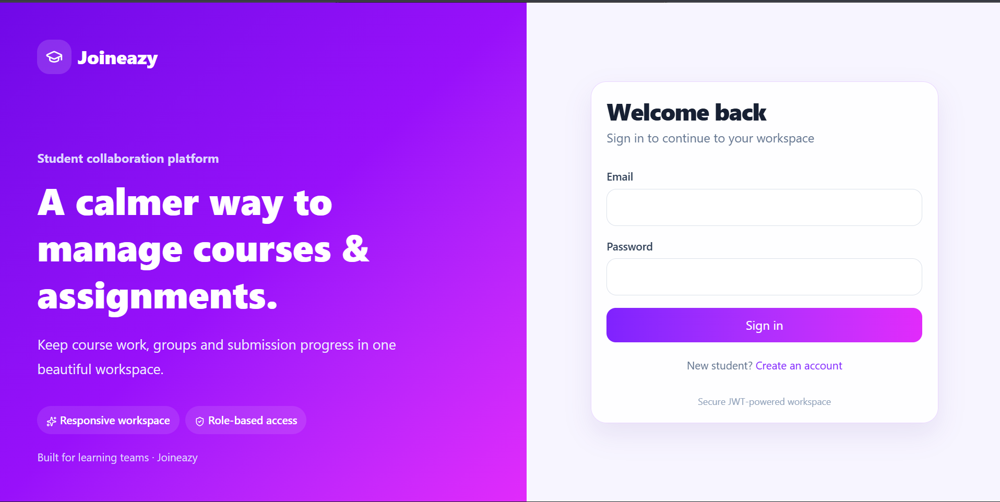
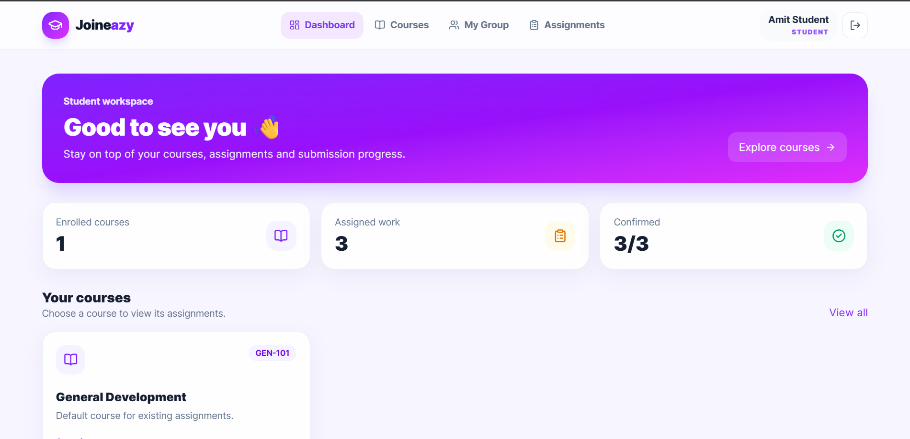
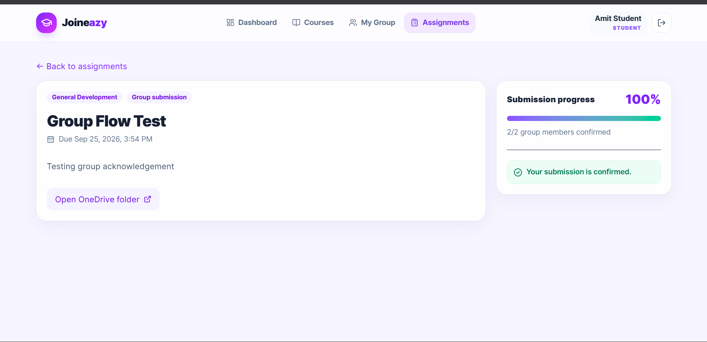
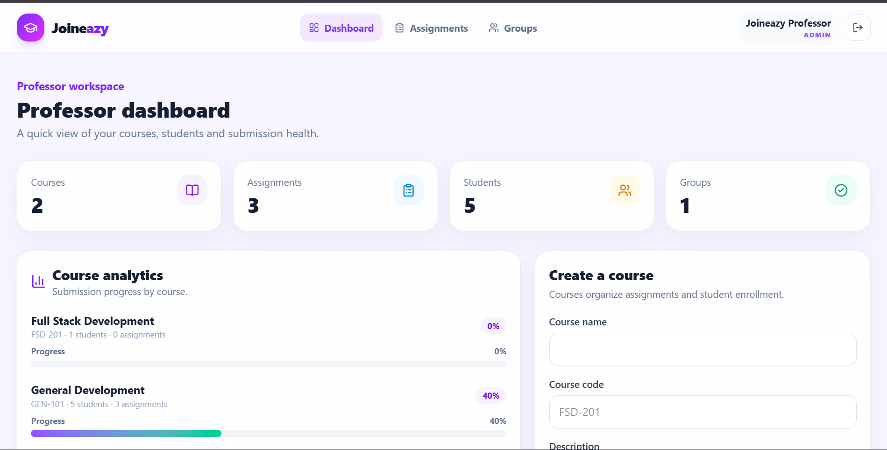
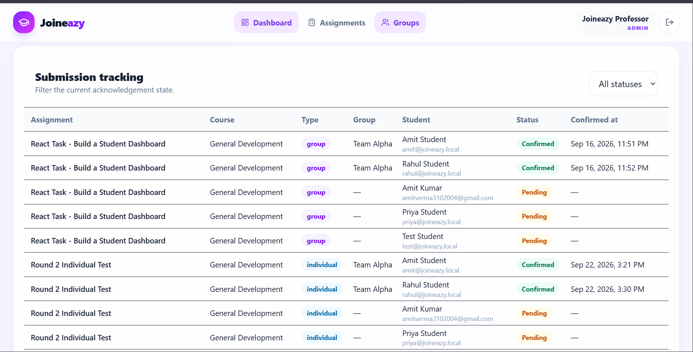

# Joineazy – Round 2

 A student collaboration platform that helps students manage their courses, assignments, groups, and submissions in one place. Professors can create courses and assignments, enroll students, and track submission progress.

Built with React, Tailwind CSS, Node.js, Express.js, PostgreSQL, and JWT authentication.
## Features

### Student
- JWT-based login and registration
- View enrolled courses and assignments
- Individual and group assignments
- Create and manage groups
- OneDrive submission links
- Submission acknowledgement and progress tracking

### Professor / Admin
- Course creation and student enrollment
- Assignment CRUD
- Assign assignments to all students or selected groups
- Submission monitoring
- Pending / Confirmed submission filters
- Course and submission analytics

## UI/UX Design

The Round 2 UI was redesigned with a clean, responsive SaaS-style interface focused on clarity and ease of use.

- Responsive layouts were used so dashboards, cards and forms work across desktop, tablet and mobile.
- Reusable UI components provide consistent buttons, cards, inputs, badges and progress indicators throughout the application.
- Color-coded badges and progress bars make pending, confirmed and completed states easy to understand.
- Loading states, success messages and error feedback provide clear responses to user actions.
- Subtle animations and hover effects improve interaction feedback without distracting from the main content.
- Separate Student and Professor dashboards keep role-specific information and actions easy to find.

## Tech Stack

Frontend: React, Tailwind CSS, Vite
Backend: Node.js, Express.js, JWT
Database: PostgreSQL
Tools: Git, GitHub, Docker

## Project Structure

Joineazy-Task1-AmitKumar/
├── frontend/
├── backend/
│   ├── src/
│   └── migrations/
├── docs/
│   └── screenshots/
├── README.md
└── ...

## Local Setup

### Backend

cd backend
npm install

Create a .env file:

PORT=5000
DATABASE_URL=postgresql://postgres:<PASSWORD>@localhost:5432/joineazy
JWT_SECRET=<YOUR_SECRET>
CLIENT_URL=http://localhost:5173

Start the backend:

npm run dev

### Frontend

Open another terminal:

cd frontend
npm install
npm run dev

Frontend: http://localhost:5173
Backend: http://localhost:5000

## Demo Credentials

Professor/Admin:

admin@joineazy.local
Admin@123

Student:

amit@joineazy.local
Student@123

## Screenshots

The following screenshots demonstrate the main application flow.

### Login

### Student Dashboard

### Assignment Details

### Professor Dashboard

### Submission Tracking

## Component Architecture

The frontend is organized into reusable components and role-based pages.

- Layout.jsx – Application layout and navigation
- UI.jsx – Reusable UI components such as cards, buttons, inputs, badges and progress bars
- Auth.jsx – Login and registration
- Student.jsx – Student dashboard, courses, assignments and group functionality
- Admin.jsx – Professor dashboard, courses, assignments and submission tracking
- api.js – Centralized API communication

The backend follows a similar separation between routes, controllers, database configuration and application setup.

## Architecture

React + Tailwind
       |
       v
   REST API
       |
       v
Node.js + Express
       |
       v
   PostgreSQL

JWT authentication and role-based authorization control access to Student and Professor features.

## Demo Video

Watch Demo Video: YOUR_VIDEO_LINK

## Deployment

Frontend: YOUR_VERCEL_LINK

Backend: YOUR_BACKEND_LINK

## Author

Amit Kumar
